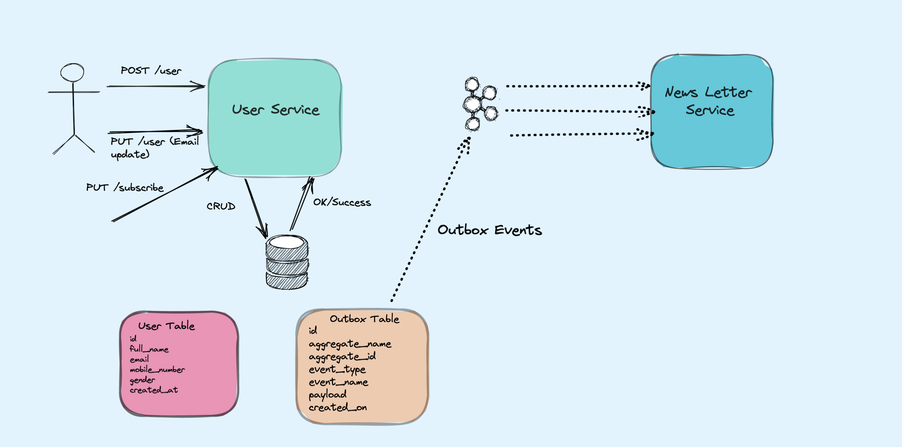

# Outbox Pattern Example With CDC using Debezium

### Technolgies Used
- Java 11
- Spring Boot 2x and Spring Cloud.
- Docker.
- Postgres.
- Mongo DB.
- Gradle.
- Kafka.
- Debezium Kafka Connect.
- Apache Kafka.

### 

### Usage
``` shell
$ cd outbox-transformer  
$ ./gradlew clean build  
$ docker build -t outbox-transformer .
```
Now execute docker-compose
``` shell
$ cd .. (Go to root directory that's where docker-compose.yaml file resides. Then run below command  
$ docker-compose up -d
```
This will start all the infra needed for the demo.

**Create topics and Debezium Connector configuration. For Simplicity, I have created a shell script file for that job for us.**

``` shell
$ ./init.sh  
--------------  
-e  
-------- Creating Kafka Topics Initiated --------  
-e  
-------- Creating Kafka Topics new_user --------  
WARNING: Due to limitations in metric names, topics with a period ('.') or underscore ('_') could collide. To avoid issues it is best to use either, but not both.  
Created topic new_user.  
-e  
-------- Creation Kafka Topics new_user Completed --------  
-e  
-------- Creating Kafka Topics news_letter_subscription --------  
WARNING: Due to limitations in metric names, topics with a period ('.') or underscore ('_') could collide. To avoid issues it is best to use either, but not both.  
Created topic news_letter_subscription.  
-e  
-------- Creation Kafka Topics news_letter_subscription Completed --------  
-e  
-------- Creating Kafka Topics email_changed --------  
WARNING: Due to limitations in metric names, topics with a period ('.') or underscore ('_') could collide. To avoid issues it is best to use either, but not both.  
Created topic email_changed.  
-e  
-------- Creation Kafka Topics email_changed Completed --------  
-e  
-------- Creating Outbox Kafka Connector For Debezium --------  
{"name":"student-outbox-connector","config":{"connector.class":"io.debezium.connector.postgresql.PostgresConnector","tasks.max":"1","database.hostname":"postgres","database.port":"5432","database.user":"postgres","database.password":"postgres","database.dbname":"user_DB","database.server.name":"pg-outbox-server","tombstones.on.delete":"false","table.whitelist":"public.outbox","transforms":"outbox","transforms.outbox.type":"com.eresh.outbox.OutboxTransformer","name":"student-outbox-connector"},"tasks":[],"type":"source"}-e  
-------- Creating Outbox Kafka Connector For Debezium is Completed --------
```
We have done all infra setups. It’s time to start the services.

-   Start User Service as Spring Boot application. You can customize environment variables as per your needs.
-   Start NewsLetter Service as a Spring Boot application. You can customize environment variables as per your needs. (_For this you need to install MongoDB in your local. I used Community Edition 4.2 version_).

**_Use Case 1, Create New User_**

Let’s Create a new user. During the creation of the user the `User Service` will save the user in its local copy of `USERS Table`and another copy in `OUTBOX TABLE` with `event_name` as `new_user` . Then, the CDC of Debezium Kafka Connect will publish the newly created event on the topic. This topic is subscribed by `News Letter Service` and creates two default News Letters to the users `Best Sellers, Weekly Frequency` and `Hot keywords, Monthly Frequency` .

``` shell
$ curl -X POST \                                                                                                        
  '[http://localhost:9000/api/user'](http://localhost:9000/api/user%27) \  
  -H 'content-type: application/json' \  
  -d '{  
    "fullName": "Medium Demo",  
    "email": "[medium.demos@gmail.com](mailto:medium.demos@gmail.com)",  
    "mobileNumber": "+919876543214",  
    "gender" : "Male"  
}'  
{"id":"a2beaf38-4569-44e6-8d37-bf54553f7b69","fullName":"Medium Demo","email":"[medium.demos@gmail.com](mailto:medium.demos@gmail.com)","mobileNumber":"+919876543214","gender":"Male","createdAt":"2021-08-19T16:35:29.719768"}
```
**Verify-in User Service Tables**

A new record is created in `User` table and `Outbox` table with `event_name` as `new_user` .
``` shell
docker-compose -f docker-compose.yaml exec postgres bash -c 'psql -U $POSTGRES_USER $POSTGRES_DB
psql (9.6.22)
Type "help" for help.
```
``` sql
user_DB=# select * from users;
                  id                  |  full_name   |         email          | mobile_number | gender |         created_at
--------------------------------------+--------------+------------------------+---------------+--------+----------------------------
 2f631996-bf92-428d-92be-c17dd5098f44 | Tom Cruise   | tom.cruise@gmail.com   | +919160012345 | Male   | 2021-08-19 10:40:26.325441
 3a75f40a-1879-4f8b-9fd2-32e3bce0189b | John Wick    | john.wick@hotmail.com  | +919160012346 | Male   | 2021-08-19 10:40:26.325441
 9bf33a01-2e61-4265-b9bd-ad87ceeaa188 | Jason Bourne | jason.bourne@gmail.com | +919160012347 | Male   | 2021-08-19 10:40:26.325441
 3dbecfe7-5570-472d-9ff0-8e268e7c68d8 | Black Widow  | black.widow@gmail.com  | +919160012348 | Female | 2021-08-19 10:40:26.325441
 3480830b-0201-4c29-8bfd-4ba57bd4929e | Harley Quinn | harley.quinn@gmail.com | +919160012340 | Female | 2021-08-19 10:40:26.325441
 a2beaf38-4569-44e6-8d37-bf54553f7b69 | Medium Demo  | medium.demos@gmail.com | +919876543214 | Male   | 2021-08-19 16:35:29.802427
(6 rows)

user_DB=# select * from outbox;
                  id                  | aggregate_name |             aggregate_id             | event_type | event_name |                        payload                         |         created_on
--------------------------------------+----------------+--------------------------------------+------------+------------+--------------------------------------------------------+----------------------------
 b2276951-b1f6-4e40-a9e6-6e6082f2e1a5 | USER           | a2beaf38-4569-44e6-8d37-bf54553f7b69 | I          | new_user   | {                                                     +| 2021-08-19 16:35:29.807441
                                      |                |                                      |            |            |   "id" : "a2beaf38-4569-44e6-8d37-bf54553f7b69",      +|
                                      |                |                                      |            |            |   "fullName" : "Medium Demo",                         +|
                                      |                |                                      |            |            |   "email" : "medium.demos@gmail.com",                 +|
                                      |                |                                      |            |            |   "mobileNumber" : "+919876543214",                   +|
                                      |                |                                      |            |            |   "gender" : "Male",                                  +|
                                      |                |                                      |            |            |   "createdAt" : [ 2021, 8, 19, 16, 35, 29, 719768000 ]+|
                                      |                |                                      |            |            | }                                                      |
(1 row)
```
**Verify NewsLetter Service**
``` json
[
{
    "_id": {
        "$oid": "611e3afa70cf211fd2296a5b"
    },
    "userId": "a2beaf38-4569-44e6-8d37-bf54553f7b69",
    "newsLetter": "Best Sellers",
    "frequency": "Weekly",
    "email": "medium.demos@gmail.com",
    "createdOn": {
        "$date": "2021-08-19T11:05:30.626Z"
    },
    "_class": "com.eresh.outbox.mongo.model.NewsLetterSubscription"
},
{
    "_id": {
        "$oid": "611e3afa70cf211fd2296a5c"
    },
    "userId": "a2beaf38-4569-44e6-8d37-bf54553f7b69",
    "newsLetter": "Hot Keywords",
    "frequency": "Monthly",
    "email": "medium.demos@gmail.com",
    "createdOn": {
        "$date": "2021-08-19T11:05:30.627Z"
    },
    "_class": "com.eresh.outbox.mongo.model.NewsLetterSubscription"
}
]
```
**_Use Case 2, Users can create Subscriptions_**

During this use case, there is no action on `User Service` . But I invoked the `News Letter Service` through `User Service` (Please bear with me on this). This will add a new row in `outbox` table with `event_name` as `news_letter_subscription` .

``` shell
$ curl --location --request PUT '[http://localhost:9000/api/user/subscribe'](http://localhost:9000/api/user/subscribe%27) \                                         
--header 'Content-Type: application/json' \  
--data-raw '{  
    "userId": "a2beaf38-4569-44e6-8d37-bf54553f7b69",  
    "subscriptions": [  
        {  
            "frequency": "Monthly",  
            "newsLetter": "Top Brands"  
        }  
    ]  
}'
```

A new row has been inserted in outbox table with `event_name` as `news_letter_subscription` .
```sql
user_DB=# select * from outbox;
                  id                  | aggregate_name |             aggregate_id             | event_type |        event_name        |                        payload                         |         created_on
--------------------------------------+----------------+--------------------------------------+------------+--------------------------+--------------------------------------------------------+----------------------------
 b2276951-b1f6-4e40-a9e6-6e6082f2e1a5 | USER           | a2beaf38-4569-44e6-8d37-bf54553f7b69 | I          | new_user                 | {                                                     +| 2021-08-19 16:35:29.807441
                                      |                |                                      |            |                          |   "id" : "a2beaf38-4569-44e6-8d37-bf54553f7b69",      +|
                                      |                |                                      |            |                          |   "fullName" : "Medium Demo",                         +|
                                      |                |                                      |            |                          |   "email" : "medium.demos@gmail.com",                 +|
                                      |                |                                      |            |                          |   "mobileNumber" : "+919876543214",                   +|
                                      |                |                                      |            |                          |   "gender" : "Male",                                  +|
                                      |                |                                      |            |                          |   "createdAt" : [ 2021, 8, 19, 16, 35, 29, 719768000 ]+|
                                      |                |                                      |            |                          | }                                                      |
 f92ae66f-57bf-4938-bfa7-6f4e50a25a55 | USER           | a2beaf38-4569-44e6-8d37-bf54553f7b69 | I          | news_letter_subscription | {                                                     +| 2021-08-19 16:54:15.985291
                                      |                |                                      |            |                          |   "userId" : "a2beaf38-4569-44e6-8d37-bf54553f7b69",  +|
                                      |                |                                      |            |                          |   "email" : "medium.demos@gmail.com",                 +|
                                      |                |                                      |            |                          |   "subscriptions" : [ {                               +|
                                      |                |                                      |            |                          |     "frequency" : "Monthly",                          +|
                                      |                |                                      |            |                          |     "newsLetter" : "Top Brands"                       +|
                                      |                |                                      |            |                          |   } ]                                                 +|
                                      |                |                                      |            |                          | }                                                      |
(2 rows)
```
**Verify NewsLetter Service**

A new record is inserted in the document with the subscription details.
``` json
{
    "_id": {
        "$oid": "611e3f6070cf211fd2296a5d"
    },
    "userId": "a2beaf38-4569-44e6-8d37-bf54553f7b69",
    "newsLetter": "Top Brands",
    "frequency": "Monthly",
    "email": "medium.demos@gmail.com",
    "createdOn": {
        "$date": "2021-08-19T11:24:16.596Z"
    },
    "_class": "com.eresh.outbox.mongo.model.NewsLetterSubscription"
}
```
**Use Case 3, Update email of the user**

This will update the `USER` table and insert a new row to `OUTBOX` table `event_name` as `email_changed`. The subscriber listening to the topic in `News Letter Service` will update all the subscriptions for users with the modified email.

``` shell
$ curl --location --request PUT '[http://localhost:9000/api/user/email/a2beaf38-4569-44e6-8d37-bf54553f7b69'](http://localhost:9000/api/user/email/a2beaf38-4569-44e6-8d37-bf54553f7b69%27) \  
--header 'Content-Type: application/json' \  
--data-raw '{  
    "email" : "[medium.demo@medium.com](mailto:medium.demo@medium.com)"  
}'  
{"id":"a2beaf38-4569-44e6-8d37-bf54553f7b69","fullName":"Medium Demo","email":"[medium.demo@medium.com](mailto:medium.demo@medium.com)","mobileNumber":"+919876543214","gender":"Male","createdAt":"2021-08-19T16:35:29.802427"}
```

**Verify-in User Service Tables**

The `User` the table is updated and a new row is added in the outbox with `event_name` as `email_changed` .

```sql
user_DB=# select * from users;
                  id                  |  full_name   |         email          | mobile_number | gender |         created_at
--------------------------------------+--------------+------------------------+---------------+--------+----------------------------
 2f631996-bf92-428d-92be-c17dd5098f44 | Tom Cruise   | tom.cruise@gmail.com   | +919160012345 | Male   | 2021-08-19 10:40:26.325441
 3a75f40a-1879-4f8b-9fd2-32e3bce0189b | John Wick    | john.wick@hotmail.com  | +919160012346 | Male   | 2021-08-19 10:40:26.325441
 9bf33a01-2e61-4265-b9bd-ad87ceeaa188 | Jason Bourne | jason.bourne@gmail.com | +919160012347 | Male   | 2021-08-19 10:40:26.325441
 3dbecfe7-5570-472d-9ff0-8e268e7c68d8 | Black Widow  | black.widow@gmail.com  | +919160012348 | Female | 2021-08-19 10:40:26.325441
 3480830b-0201-4c29-8bfd-4ba57bd4929e | Harley Quinn | harley.quinn@gmail.com | +919160012340 | Female | 2021-08-19 10:40:26.325441
 a2beaf38-4569-44e6-8d37-bf54553f7b69 | Medium Demo  | medium.demos@gmail.com | +919876543214 | Male   | 2021-08-19 16:35:29.802427
(6 rows)

user_DB=# select * from outbox;
                  id                  | aggregate_name |             aggregate_id             | event_type |        event_name        |                        payload                         |         created_on
--------------------------------------+----------------+--------------------------------------+------------+--------------------------+--------------------------------------------------------+----------------------------
 b2276951-b1f6-4e40-a9e6-6e6082f2e1a5 | USER           | a2beaf38-4569-44e6-8d37-bf54553f7b69 | I          | new_user                 | {                                                     +| 2021-08-19 16:35:29.807441
                                      |                |                                      |            |                          |   "id" : "a2beaf38-4569-44e6-8d37-bf54553f7b69",      +|
                                      |                |                                      |            |                          |   "fullName" : "Medium Demo",                         +|
                                      |                |                                      |            |                          |   "email" : "medium.demos@gmail.com",                 +|
                                      |                |                                      |            |                          |   "mobileNumber" : "+919876543214",                   +|
                                      |                |                                      |            |                          |   "gender" : "Male",                                  +|
                                      |                |                                      |            |                          |   "createdAt" : [ 2021, 8, 19, 16, 35, 29, 719768000 ]+|
                                      |                |                                      |            |                          | }                                                      |
 f92ae66f-57bf-4938-bfa7-6f4e50a25a55 | USER           | a2beaf38-4569-44e6-8d37-bf54553f7b69 | I          | news_letter_subscription | {                                                     +| 2021-08-19 16:54:15.985291
                                      |                |                                      |            |                          |   "userId" : "a2beaf38-4569-44e6-8d37-bf54553f7b69",  +|
                                      |                |                                      |            |                          |   "email" : "medium.demos@gmail.com",                 +|
                                      |                |                                      |            |                          |   "subscriptions" : [ {                               +|
                                      |                |                                      |            |                          |     "frequency" : "Monthly",                          +|
                                      |                |                                      |            |                          |     "newsLetter" : "Top Brands"                       +|
                                      |                |                                      |            |                          |   } ]                                                 +|
                                      |                |                                      |            |                          | }                                                      |
(2 rows)

user_DB=# select * from users where id = 'a2beaf38-4569-44e6-8d37-bf54553f7b69';
                  id                  |  full_name  |         email          | mobile_number | gender |         created_at
--------------------------------------+-------------+------------------------+---------------+--------+----------------------------
 a2beaf38-4569-44e6-8d37-bf54553f7b69 | Medium Demo | medium.demo@medium.com | +919876543214 | Male   | 2021-08-19 16:35:29.802427
(1 row)

user_DB=# select * from outbox;
                  id                  | aggregate_name |             aggregate_id             | event_type |        event_name        |                        payload                         |         created_on
--------------------------------------+----------------+--------------------------------------+------------+--------------------------+--------------------------------------------------------+----------------------------
 b2276951-b1f6-4e40-a9e6-6e6082f2e1a5 | USER           | a2beaf38-4569-44e6-8d37-bf54553f7b69 | I          | new_user                 | {                                                     +| 2021-08-19 16:35:29.807441
                                      |                |                                      |            |                          |   "id" : "a2beaf38-4569-44e6-8d37-bf54553f7b69",      +|
                                      |                |                                      |            |                          |   "fullName" : "Medium Demo",                         +|
                                      |                |                                      |            |                          |   "email" : "medium.demos@gmail.com",                 +|
                                      |                |                                      |            |                          |   "mobileNumber" : "+919876543214",                   +|
                                      |                |                                      |            |                          |   "gender" : "Male",                                  +|
                                      |                |                                      |            |                          |   "createdAt" : [ 2021, 8, 19, 16, 35, 29, 719768000 ]+|
                                      |                |                                      |            |                          | }                                                      |
 f92ae66f-57bf-4938-bfa7-6f4e50a25a55 | USER           | a2beaf38-4569-44e6-8d37-bf54553f7b69 | I          | news_letter_subscription | {                                                     +| 2021-08-19 16:54:15.985291
                                      |                |                                      |            |                          |   "userId" : "a2beaf38-4569-44e6-8d37-bf54553f7b69",  +|
                                      |                |                                      |            |                          |   "email" : "medium.demos@gmail.com",                 +|
                                      |                |                                      |            |                          |   "subscriptions" : [ {                               +|
                                      |                |                                      |            |                          |     "frequency" : "Monthly",                          +|
                                      |                |                                      |            |                          |     "newsLetter" : "Top Brands"                       +|
                                      |                |                                      |            |                          |   } ]                                                 +|
                                      |                |                                      |            |                          | }                                                      |
 31ca13c9-6ff5-4c77-9c05-106f04996577 | USER           | a2beaf38-4569-44e6-8d37-bf54553f7b69 | U          | email_changed            | {                                                     +| 2021-08-19 17:01:07.521961
                                      |                |                                      |            |                          |   "id" : "a2beaf38-4569-44e6-8d37-bf54553f7b69",      +|
                                      |                |                                      |            |                          |   "fullName" : "Medium Demo",                         +|
                                      |                |                                      |            |                          |   "email" : "medium.demo@medium.com",                 +|
                                      |                |                                      |            |                          |   "mobileNumber" : "+919876543214",                   +|
                                      |                |                                      |            |                          |   "gender" : "Male",                                  +|
                                      |                |                                      |            |                          |   "createdAt" : [ 2021, 8, 19, 16, 35, 29, 802427000 ]+|
                                      |                |                                      |            |                          | }                                                      |
(3 rows)
```

**Verify-in NewsLetter Service**
``` json
[
{
    "_id": {
        "$oid": "611e3afa70cf211fd2296a5b"
    },
    "userId": "a2beaf38-4569-44e6-8d37-bf54553f7b69",
    "newsLetter": "Best Sellers",
    "frequency": "Weekly",
    "email": "medium.demo@medium.com",
    "createdOn": {
        "$date": "2021-08-19T11:05:30.626Z"
    },
    "_class": "com.eresh.outbox.mongo.model.NewsLetterSubscription"
},
{
    "_id": {
        "$oid": "611e3afa70cf211fd2296a5c"
    },
    "userId": "a2beaf38-4569-44e6-8d37-bf54553f7b69",
    "newsLetter": "Hot Keywords",
    "frequency": "Monthly",
    "email": "medium.demo@medium.com",
    "createdOn": {
        "$date": "2021-08-19T11:05:30.627Z"
    },
    "_class": "com.eresh.outbox.mongo.model.NewsLetterSubscription"
},
{
    "_id": {
        "$oid": "611e3f6070cf211fd2296a5d"
    },
    "userId": "a2beaf38-4569-44e6-8d37-bf54553f7b69",
    "newsLetter": "Top Brands",
    "frequency": "Monthly",
    "email": "medium.demo@medium.com",
    "createdOn": {
        "$date": "2021-08-19T11:24:16.596Z"
    },
    "_class": "com.eresh.outbox.mongo.model.NewsLetterSubscription"
}
]
```
### To stop all containers
``` shell
./shutdown.sh
```
